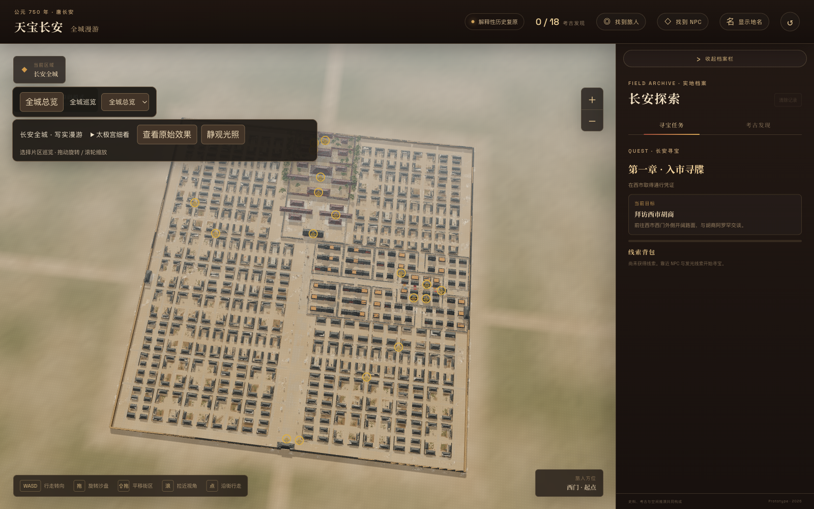
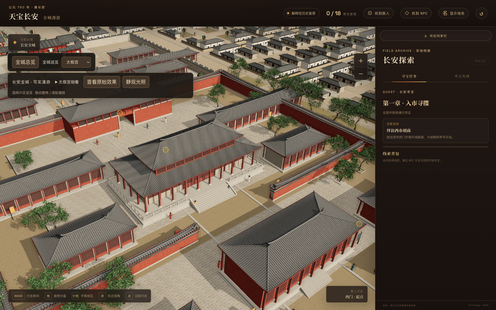
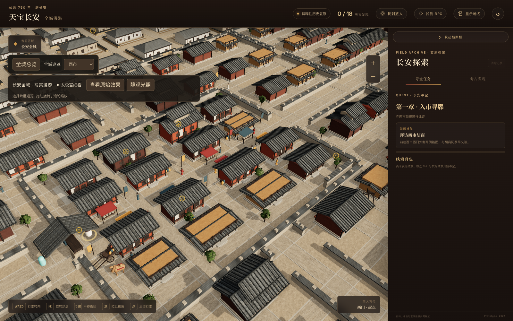

# 长安游坊录 · 太极宫与全城写实版

**Changan Tour · Taiji & City Realism**

在实时三维沙盘里游览唐代长安：从西市街巷走向太极宫，观察坊区、院落、城门与朱雀大街的空间关系。

这是 [原版 changan-tour](https://github.com/pivoine-maker/changan-tour) 的独立迭代仓库，发布太极宫与全城写实工作副本的 **v35** 状态。基于 Vite、TypeScript 和 Three.js，保留实时漫游、发现档案、任务与本地存档，并扩展建筑构件、材质、植被和可选的渐进式光照。

## 场景预览

下图来自 v35 迭代留存的实际运行截图。



从全城俯瞰理解宫城、街道与坊区的布局，再通过地点选择与镜头控制进入局部。



太极宫细化了屋顶、台基、石铺地、木构、廊庑与庭院植被，支持原始效果与写实效果切换。



西市保留可行走的街巷、摊位与地点发现，构成全城探索的起点。

## 当前内容

- **全城与坊区**：82 坊，756 栋建筑，328 处庭院；确定性的院落尺寸、侧翼、退距和高度变化。
- **宫城与城门**：太极宫建筑细节，以及南、东、西城门的石木构件。
- **材质与环境**：木材、瓦面、灰泥、夯土、草地、树木和 HDR 环境光；素材与生成记录随仓库保留。
- **实时探索**：旋转、平移、缩放、步行、地点巡览、发现档案、任务与浏览器本地存档。
- **静观光照**：可选的渐进式路径追踪；准备与采样较慢，移动镜头后重新积累，默认仍可实时游览。

## 本地运行

使用 **Node.js 22.12 或更新版本**、npm 和支持 WebGL 的现代浏览器。

```bash
git clone https://github.com/pivoine-maker/changan-tour-taiji-realism.git
cd changan-tour-taiji-realism
npm ci
npm run dev
```

打开终端显示的地址，默认入口为 `http://127.0.0.1:5173/changan-tour-taiji-realism/`。

`npm ci` 会运行 `scripts/patch-pathtracer.mjs`，为锁定的 `three-gpu-pathtracer@0.0.23` 应用资源释放与阴影遍历兼容补丁。升级该依赖时需同时检查补丁。

```bash
npm test -- --run  # 自动化测试
npm run build     # TypeScript 检查与生产构建
npm run preview   # 预览 dist 构建结果
```

## 发布校验

2026-09-23 在独立发布副本中重新运行：65 个测试文件、290 项测试通过，TypeScript 检查与生产构建通过。新基础路径下的太极宫场景加载与地点切换正常，浏览器控制台无错误或警告。凭证扫描的素材 MD5 与浏览器存档键误报经过逐项核对。

当前锁定依赖的 `npm audit` 报告有 3 条开发工具依赖告警（1 条 high、2 条 moderate，涉及 nanoid、Vitest 与其 mocker）；`npm audit --omit=dev` 为 0 条告警。本次保留已有依赖版本，未执行可能改变行为的强制升级。

## 操作

| 操作 | 效果 |
| --- | --- |
| 鼠标拖拽 | 旋转沙盘 |
| Shift + 拖拽 | 平移视角 |
| 滚轮 / 缩放按钮 | 拉近或拉远 |
| WASD / 点击道路 | 步行与道路寻路 |
| 地点下拉框 / 全城巡览 | 切换观察地点 |
| 空格 | 切换穿越障碍模式 |
| 查看原始效果 | 对比原始与写实渲染 |
| 静观光照 | 开关渐进式光照 |

## 目录

```text
src/             城市数据、场景几何、导航、发现、任务与 UI
public/          应用直接加载的模型、材质、HDR 与素材溯源
asset-sources/   素材参考、中间模型与来源记录
docs/            场景截图、设计说明与历史实现计划
scripts/         路径追踪兼容补丁与离线树叶提取工具
.github/         CI、手动 Pages 部署与 tag 发布工作流
```

`CHANGAN-CITY-V*.md`、`TAIJI-PILOT*.md` 和 `docs/superpowers/` 是历史迭代记录；其中的本地预览端口、快照位置与旧测试结果不代表当前在线服务。发布副本移除了个人绝对路径。

离线树叶提取脚本需要 Python、NumPy、SciPy，以及来源记录所列的原始 `tree_small_02.bin`（该约 95 MB 的源文件不随仓库提供）。应用运行使用已包含的 GLB 与树叶布局 JSON，无需执行提取脚本。

## 自动化

- **CI**：推送 `main` 或创建 PR 后运行测试与构建。
- **Pages**：保留手动 `workflow_dispatch` 工作流；本次只发布源码仓库。要启用站点，可在仓库 Pages 设置中选择 GitHub Actions，再运行 Deploy Pages。
- **Release**：推送 `v*` tag 时测试、构建，并上传静态站点压缩包。

构建基础路径为 `/changan-tour-taiji-realism/`；部署到其他目录时需同步修改 `vite.config.ts`。

## 素材与历史边界

素材来源见 `public/**/provenance*.json`、`asset-sources/` 和 [素材说明](ASSETS.md)。AI 生成贴图用于美术表现，不是实测 PBR 数据或历史原貌证据。

这是解释性历史城市原型。部分布局与构件是复原推测，城外平原是环境表现，仍存在重复建筑家族、简化人物与明显 CG 感，不构成逐建筑考古复原。

## 许可证

项目代码沿用原版状态，尚未指定开源许可证。仓库公开不等同于授予通用代码复用许可；第三方素材与依赖保留各自的许可和来源记录。
